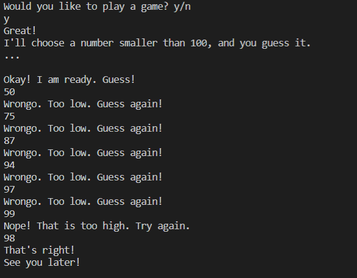

# Overview
This program is a basic number guessing game. It is beaten easily using a binary search method.

Not yet implemented:
* Error checking
* Repeatability

# Development Environment
* Visual Studio Code  
* Java 14

# Execution
Download and enjoy
Execution of the program: `java guessingGame.java`

# Useful Websites

1. [Java Reference](https://docs.oracle.com/en/java/)
2. [Java Tutorial](https://www.tutorialspoint.com/java/index.htm)